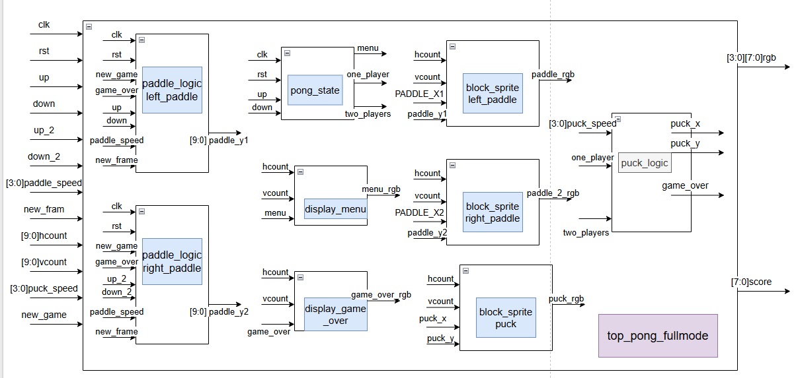
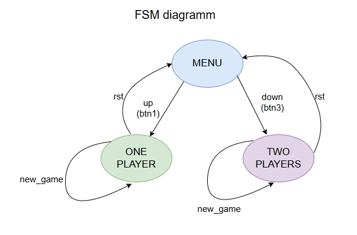

# FPGA HDMI Pong

A real-time Pong game implemented in Verilog and deployed on a Spartan-7 FPGA board. The design generates a 640×480 video signal, encodes RGB data into TMDS, serializes the HDMI channels with Xilinx primitives, and runs the game logic synchronously with the video frame rate.


## Features

- 640×480 video output at approximately 60 Hz
- TMDS encoding with running-disparity control
- HDMI serialization using Xilinx OSERDES and differential output buffers
- One-player and two-player modes
- Menu and Game Over screens generated directly from pixel coordinates
- Frame-synchronous ball and paddle movement
- Collision detection and scoring
- Configurable ball and paddle speeds
- Four-digit seven-segment score display
- Hardware implementation and verification on an FPGA board

## Design overview

The design combines a frame-synchronous game engine with a pixel-rate video and HDMI output pipeline. Game state is updated once per video frame, while the rendering logic generates RGB values combinationally for each active pixel.

The system is organized into the following subsystems:

* **Top-level integration**: clock generation, reset synchronization, game engine, score display, and HDMI output
* **Video timing**: horizontal and vertical timing state machines, synchronization signals, and pixel-coordinate generation
* **Game engine**: mode selection, paddle control, ball movement, collision detection, scoring, and Game Over behavior
* **Rendering**: combinational RGB generation from the current game state and pixel coordinates
* **TMDS pipeline**: transition minimization, disparity-aware 10-bit encoding, and 10:1 serialization
* **Display subsystem**: multiplexed four-digit seven-segment score output

## Architecture diagrams

The following diagrams focus on the internal game engine and its mode-control state machine.

### Game engine



### Mode control FSM



## Repository structure

```text
fpga-hdmi-pong/
├── rtl/
│   ├── top/       # Top-level FPGA integration
│   ├── game/      # Pong logic and rendering
│   ├── video/     # Video timing and clock generation
│   ├── tmds/      # TMDS encoding and serialization
│   ├── display/   # Seven-segment score display
│   └── common/    # Synchronizer and shared utility modules
├── constraints/   # FPGA pin and timing constraints
└── docs/          # Block diagrams and design figures
```

## Top module

Use `TOP_hdmi_pong_multiplayer` as the synthesis top module and add:

- all Verilog files under `rtl/`
- `constraints/PONG_multiplayer.xdc`

The design expects a 100 MHz board clock. The MMCM produces the pixel and serialization clocks required by the HDMI pipeline.

## Controls

- Player 1: board push buttons
- Player 2: board switches
- Ball and paddle speed: board switches
- New game: board push button
- Score: four-digit seven-segment display

The exact pin mapping is documented in `constraints/PONG_multiplayer.xdc`.

## Tools and hardware

- Verilog HDL
- AMD/Xilinx Vivado
- Spartan-7 FPGA development board
- HDMI-compatible display

## Verification

The complete design was synthesized, implemented, programmed, and tested on physical FPGA hardware with real-time HDMI output. The repository intentionally excludes Vivado-generated build directories and bitstreams.

## Academic context and attribution

This project was developed individually as part of the **Digital Systems Laboratory** course at the **University of Thessaly** during the **Winter Semester 2025–2026**.

After completing the core laboratory requirements, I extended the design with additional functionality, including one- and two-player game modes, a start menu, Game Over graphics, score tracking, configurable movement, collision handling, and seven-segment display integration. The complete system was implemented in Verilog and verified on a Spartan-7 FPGA with real-time HDMI output.

The laboratory specification and some verification infrastructure were provided by the course. The RTL included in this repository is the submitted implementation. AMD/Xilinx primitives are instantiated for clocking, serialization, and differential output.

No open-source license is currently provided. The code is shared for portfolio and educational review purposes.
